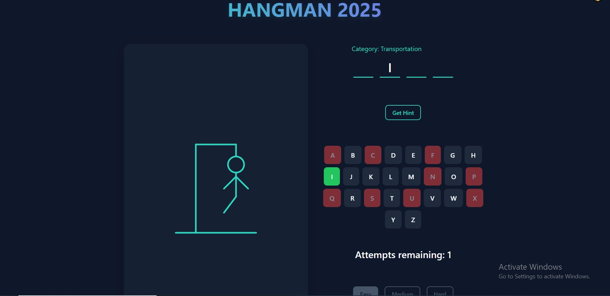

# Hangman 2025

A modern, responsive implementation of the classic word-guessing game with multiple difficulty levels, themes, and categories.



## 🎮 Features

- 🎭 **Multiple Difficulty Levels**: Easy, Medium, and Hard word sets
- 🌓 **Light & Dark Themes**: Toggle between light and dark mode
- 📱 **Responsive Design**: Play on any device from mobile to desktop
- 🔤 **Word Categories**: Words are organized by themes like Animals, Space, Music
- 💡 **Hint System**: Get help with challenging words
- ⌨️ **Keyboard Support**: Play using physical keyboard or on-screen keys
- 📊 **Score Tracking**: Keep track of your wins and losses

## 🚀 Upcoming Features

- 🔊 Sound effects
- 💾 Score persistence
- ⏱️ Timed mode
- 🏆 Achievements
- 👥 Multiplayer mode
- 📝 Custom word lists

## 🛠️ Technology Stack

- HTML5
- CSS3 (CSS Variables, Flexbox, Animations)
- JavaScript (ES6+)
- SVG for hangman visualization

## 🔧 Installation & Usage

1. Clone the repository:
   ```bash
   git clone https://github.com/yourusername/hangman-2025.git
   ```

2. Open `index.html` in your browser or set up a local server:
   ```bash
   # Using Python
   python -m http.server
   
   # Using Node.js
   npx serve
   ```

3. Play the game in your browser at `http://localhost:8000` (or the specified port)

## 📂 Project Structure

```
hangman-2025/
├── index.html               # Main game file
├── assets/
│   ├── css/                 # Stylesheets
│   │   └── styles.css       # Main CSS
│   ├── js/                  # JavaScript files
│   │   ├── game.js          # Game logic
│   │   ├── ui.js            # UI handlers
│   │   └── words.js         # Word dictionaries
│   └── images/              # Images and icons
└── docs/                    # Documentation
```

## 🔄 Development Roadmap

### Phase 1: Code Refactoring
- [x] Initial game implementation
- [ ] Extract CSS to separate files
- [ ] Extract JavaScript to modular components
- [ ] Implement proper directory structure

### Phase 2: Core Improvements
- [ ] Implement local storage for score persistence
- [ ] Add sound effects and animations
- [ ] Expand word dictionaries
- [ ] Implement proper accessibility attributes

### Phase 3: New Features
- [ ] Add user accounts (optional)
- [ ] Implement multiplayer mode
- [ ] Add custom word lists
- [ ] Create achievement system

## 🤝 Contributing

Contributions are welcome! Please feel free to submit a Pull Request.

1. Fork the repository
2. Create your feature branch (`git checkout -b feature/amazing-feature`)
3. Commit your changes (`git commit -m 'Add some amazing feature'`)
4. Push to the branch (`git push origin feature/amazing-feature`)
5. Open a Pull Request

See [CONTRIBUTING.md](docs/CONTRIBUTING.md) for more information.

## 📜 License

This project is licensed under the MIT License - see the [LICENSE](LICENSE) file for details.

## 🙏 Acknowledgments

- Original game concept by [Traditional]
- Modern implementation by [Your Name]
- Word lists compiled from various sources